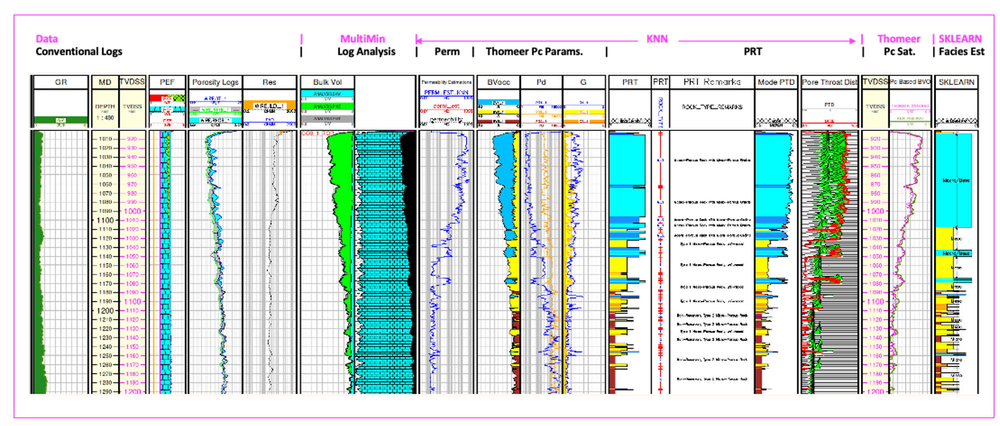
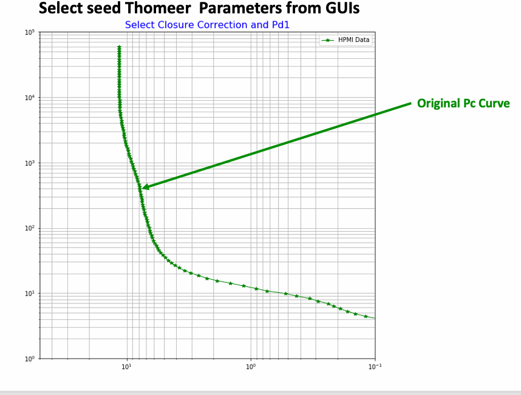
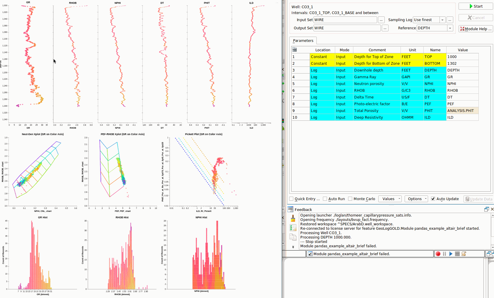
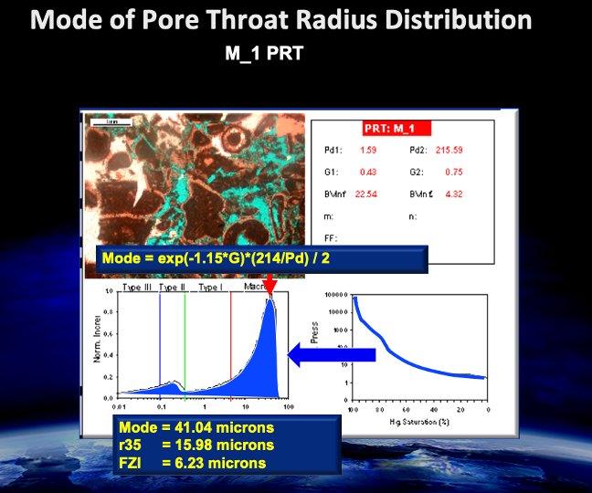
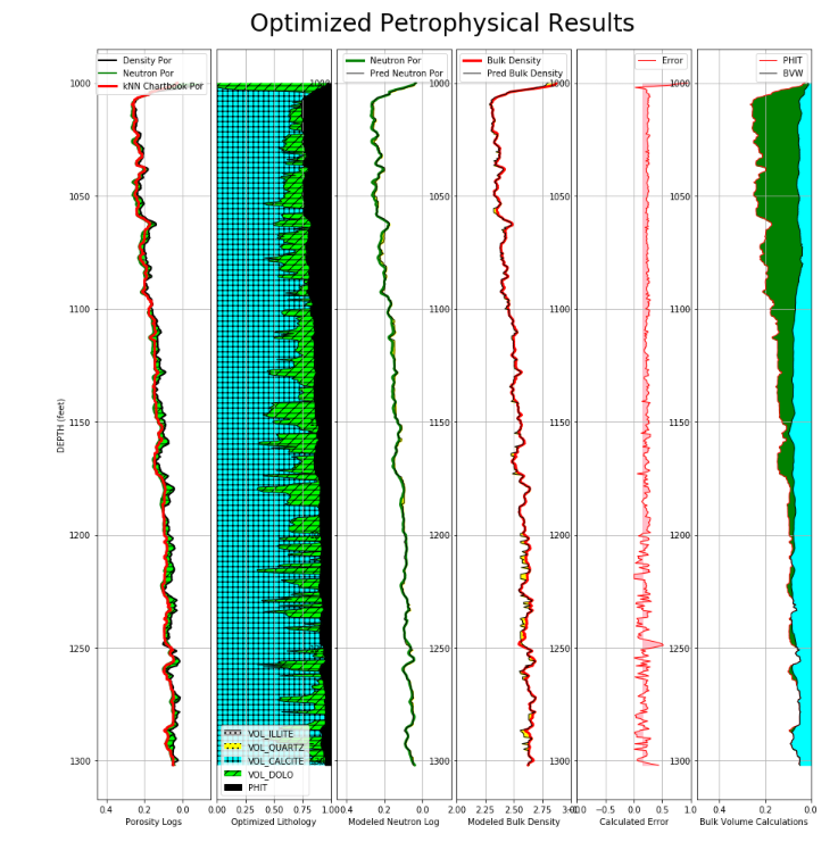
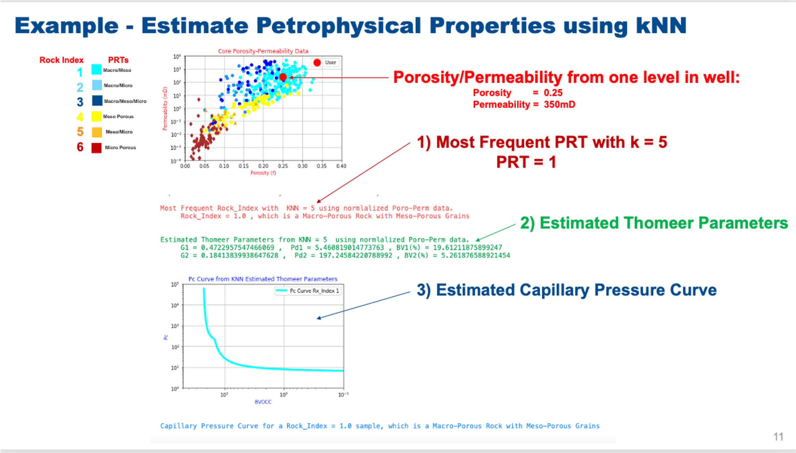
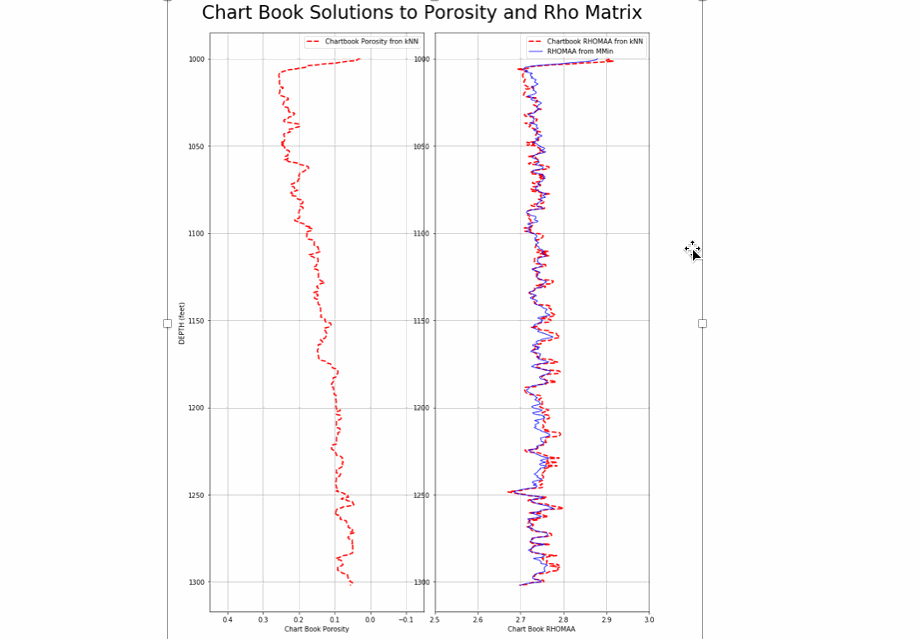
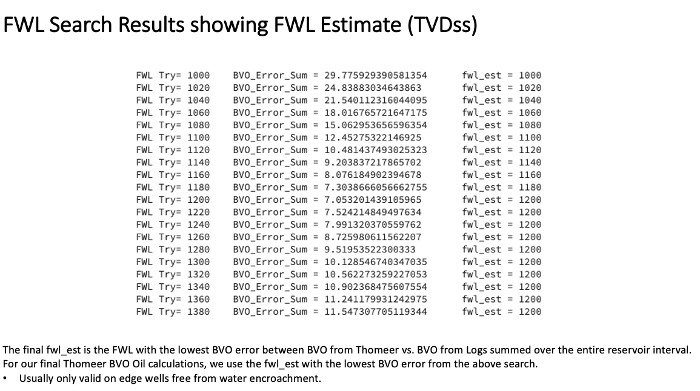

# Carbonate Reservoir Characterization workflow using Clerke’s carbonate Arab D Rosetta Stone calibration data to provide for a full pore system characterization with modeled saturations using Thomeer Capillary Pressure parameters for an Arab D complex carbonate reservoir.
# New Scipy Optimization for Lithology including Illite Clay. This also has the FWL Search routine too.
# INSTALL NOTE: Please delete any previous installations and re-install this repositiry in full and keep the intire project together in one subirectory since there are relative paths.

This repository contains 4 python Jupyter Notebooks to use as help files for our Geolog Carbonate Reservoir Characterization Workflow to demonstrate a tried and proven workflow employing the techniques as described by Phillips et al. (1) used in the characterization of most Arab D reservoirs in Saudi Arabia. Permeability, Petrophysical Rock Types (PRT), Capillary Pressure and modeled saturations are all estimated or calculated within this workflow in order to characterize this complex carbonate reservoirs, and Clerke’s (2) Arab D Rosetta Stone core analysis database is used as the calibration data. 

The first Jupyter Notebook is called:

        1_Workflow_Intro_with_Altair_Interrogation_Log_and_RosettaStone_Data.ipynb

and it demonstrates how we interrogate our well log data as well as our Rosetta Stone calibration data using python's Altair. 

The second notebook is called: 

        2_Chartbook_Porosity_Optimized-Lithology_Perm_Thomeer_Saturations_ver3-Lasio_with_FWL_search-implement_Optimization-Illite.ipynb
        
and this notebook reads in the well log data from a .las file using Lasio and then performs all of the workflow steps 2 through 5 as discussed below. 

The third notebook called:

        6_PRT Classification_carbonate_AMMY.ipynb

and this notebook provides a secondary technique to estimate Petrophysical Rock Types (PRTs) employing python’s Sklearn as published by Hall(3). We could have estimated Depositions of Environment or other types of categoric geologic facies too used in this Sklearn prediction process. 

The fourth notebook is used to process your High Pressure Mercury Injection (HPMI) Capillary Pressure data and fit the Thomeer hyperbola to these data to determine the Thomeer Capillary Pressure parameters. You would use this program to create your own Thomeer Parameter database and modify this workflow to include your Thomeer Parameer database for your reservoir.

        Thomeer_from_Pc-curvefit.ipynb

The image below shows how this interactive process works:

This program uses Scipy Optimize Curve_fit to estimate the appropriate Thomeer parameters necessary to model the HPMI data. The points selected from the GUIs are used to estimate boundary conditions for these estimations, and the estimations for this example are shown below:

            Thomeer Parameters Estimated from Imported HPMI Data:
            Pd1 = 8.67  ,  G1 = 0.54 , BV1 = 10.13
            Pd2 = 389.1 ,  G2 = 0.24 , BV2 = 4.8

We also have a complete Geolog project in a GitHub repository with Geolog python loglan at the following link:

        https://github.com/Philliec459/Geolog-Used-to-Automate-the-Characterization-Workflow-using-Clerkes-Rosetta-Stone-calibration-data

This repository has one well to use with our workflow to interrogate and characterize this typical Arab D carbonate reservoir. This example will serve as the basis for a full-field reservoir characterization for all wells throughout the entire field. In this example we are showing the results for just one well, but in the full-field reservoir characterization we would follow the same workflow and apply the same process to all wells in the field. The final objective would be to use these results to create a 3D static model of porosity, permeability, Petrophysical Rock Types (PRT), capillary pressure parameters and saturations. Typically, this static model would then be used to initialize the dynamic model for reservoir simulation. 

We are using Ed Clerke’s Rosetta Stone, Arab-D carbonate dataset from Ghawar field in Saudi Arabia as the calibration data. This is a very special carbonate dataset. Clerke randomly selected the final calibration samples from 1,000’s of initial core plugs for the final dataset.  The Rosetta Stone data cover the full range in poro-perm space and Petrophysical Rock Types (PRTs) observed in the Arab D reservoir. For each sample Clerke acquired High Pressure Mercury Injection (HPMI) data, and then fit the HPMI capillary pressure curve using the Thomeer hyperbola (see Altair Plot of Capillary Pressure curves) created from the Initial Displacement Pressure (Pdi), Pc curvature term Gi that relates to the variability of pore throats and Bulk Volume Occupied (BVocci) that is related to the Pore Volume for each pore system 'i'.  From these results (primarily from Pd) Clerke defined his Petrophysical Rock Types (PRT). For this Arab D reservoir, most PRTs have a dual-porosity system, and some PRTs have up to 3 pore systems. 

# Suggested Arab D Carbonate Workflow:
The following workflow and processing is suggested to interrogate, process, interpret and model the petrophysical properties of a typical Arab D carbonate reservoir using Clerke’s Arab D Rosetta Stone Carbonate database as calibration. The workflow consists of the following steps:

1) Interrogate the Well Log data and Rosetta Stone calibration data using standard Geolog layouts, cross plots and histograms and then use a python loglan featuring Altair, which is interactive software driven from a Geolog Module Launcher.

### Altair used to Interrogate the Rosetta Stone Thomeer Capillary Pressure curves and Petrophysical Rock Types (PRTs):

### Altair Used to Interrogate the Well log data in Geolog:

### Petrophysical Rock Typing (PRT):
Most macro rock typically has a dual porosity system where the Pore Throat Distribution (PTD) will have two modes as shown below. 

The macro portion of the rock will have a mode greater than 2 microns with a second (or third) mode less than 2 microns. Probably the most abundant PRT is the M_1. This is a macro-porous rock with a mode in the macro portion of the PTD and a second mode in the meso-porosity range. In this PRT both the macro pores and meso-porous grains can have oil saturations once the capillary pressure is great enough to drive out the water. The M_2 PRT is also a macro rock, but the second pore system is micro-porous and is too tight to have hydrocarbon saturations. The Table below shows Clerke's description of his PRT's. 

The following are some example results using Altair where the data in cross plots can be selected and then the appropriate data for those selected samples are shown in the bar charts below the cross plots. 

### Altair used to Compare Clerke's Petrophysical Rock Types (PRTs) to Winland r35 and Amaefule FZI and RQI:

One of the benefits of working with Thomeer parameters is that the exact mode of the PTD (radius) can be calculated for each sample using the Buiting Mode equation as shown below:

        Mode(microns) = (exp(-1.15 * G) * (214/Pd))/2
        
Again, this equation gives us the mode of the pore system, and we normally only calculate the mode of the largest pore system in the sample. 

In the Altair plots below the first row of poro-perm xplot show the PRT and actual Mode of Pore Throats on the Z color axis. The second row of xplots show the Winland r35 on the color axis, Amaefule FZI and RQI on the color axis.

The actual mode of the Pore Throat Distribution is shown in the first row of the poro-perm xplots. In Rock Typing Winlands' r35 and Amaefule's FZI or RQI attempt to predict the most dominant pore throat. In dual-porosity carbonates Winland's r35 is usually a close proximity, but FZI does not do well. RQI appears to be off, but captures the range of the pore throats a bit better. 

Windland's r35 is calculated:

        r35(microns) = 10**(0.732 + 0.588*log(Permeability) - 0.864*log(Porosity*100))

Amaefule-Kersey FZI is calculated:

        RQI(microns) = 0.0314 * sqrt(Permeability/Porosity)
        
        Phiz = Porosity / (1 - Porosity)

        FZI(microns) = RQI / Phiz
    
where Porosity is a volume fraction and not percent. 

On this dataset it appears that r35 has the best match to the actual mode of the Pore Throat Distribution. The bi-modality in the macro-porous rock has FZI falling between the two modes since it is the mean pore throat radius. Windland's r35 does a fairly good job of estimating the most dominant pore throat. 

2) Run MultiMin for a solid log analysis model using the typical minerals found in the Arab D reservoir; Limestone, Dolomite, Anhydrite and Illite. With MultiMin we always use environmentally corrected log data and use the calculated uncertainties for each log curve employed in the analysis. 

To serve as an example we have included this processing in our second Jupyter Notebook. The notebook first uses digitized chartbook data as the basis for our kNN Porosity (PHIT) and Rho Matrix density calculations used in the analysis. Once PHIT is estimated, then we then use Scipy Optimize (minimize) to estimate our carbonate lithology. 

Our primary function is the following in Scipy trying to estimate volumes of Calcite and Dolomite.

        fun = lambda x: (RHOB2 - (2.52*vol_illite + 2.71*x[0]+2.847*x[1]+PHIT*FD)) + (TNPH - (0.247*vol_illite + 0*x[0]+0.005*x[1]+PHIT*1))

Which is using two log response functions that are to be minimized:

        RHOB_theoretical =  2.52*vol_illite + 2.71*x[0]+2.847*x[1]+PHIT*FD

        TNPH_theoretical =  0.247*vol_illite + 0*x[0]+0.005*x[1]+PHIT*1

where res.x[0] = VOL_CALCITE and res.x[1] = VOL_DOLO. The objective is to minimize the difference between RHOB - RHOB_theoretical and TNPH - TNPH_theoretical while solving for our lithology. We have calculated that error from normalized curves, and this error is plotted on the optimized lithology plot in the last track. 

We would like to thank Andy McDonald and his Petrophysics Python Series GitHub repository for his examples and ideas. We used his methods to use Lasio to read in the las file and are using his hatch fill example in our notebook depth plots. Thank you Andy. 

This is all still considered work in progress, but please find below an example of the output. 

3) Use available core data from the representative reservoir/field to build a petrophysical model to estimate permeability for all wells in field using our python loglan of kNN using normalized input data and weighted by Euclidean distances for each of the nearest neighbors. 

The next step is to estimate Petrophysical Rock Types (PRT) as defined by Clerke and Thomeer Capillary Pressure parameters. The following example shows the actualy Thomeer parameters for a narrow range of selected porosity and permeability samples from the cross plot. The narrow range of selected samples in poro-perm space shows just how similar the Thomeer parameters are for the selected samples. Step 4 below using kNN will actually improve on this estimation.

4) Using the kNN estimated permeability from step 3 with calculated Total Porosity (PHIT) from MultiMin to query Clerke’s Rosetta Stone core database to predict the following Petrophysical data using kNN:
    - Petrophysical Rock Types (PRT) as defined by Clerke (M_1 Macro/Meso, M_2 Macro/Micro, M_1_2 Macro/Meso/Micro, Type1 Meso, Type 1_1 Meso/Micro and Type 2 Micro PRTs.
    - Thomeer Capillary Pressure parameters (Pdi, Gi and BVocci) for each pore system i over the reservoir interval

5) Use the Thomeer parameters from step 4 to model Capillary Pressure saturations based on reservoir Capillary Pressure (buoyancy) due height above the Free Water Level (FWL) and the fluid density differences in the reservoir. In this instance we compare the Bulk Volume Oil (BVO) from our log analysis vs. BVO from Thomeer-based capillary pressure saturations. BVO is pore volume weighted.

#### Free Water Level Search:
We have provided a FWL Search technique in python too to estimate the FWL elevation (TVDss) in each key well to be used to create a FWL plane for the field. To model Capillary Pressure saturations, it is essential to have a proper Free Water Level (FWL). Reservoir Capillary Pressure or buoyancy is dependent upon the height above the FWL. 

On new discoveries the FWL is usually determined from Formation Test data plotting the pressure data vs. TVDss to find the intersection of the water gradient vs. hydrocarbon gradient. The elevation of this intersection is the FWL or zero Capillary Pressure. However, on older fields, this type of data is typically not available prior to pressure depletion and/or fluid contact movements in the field. Therefore, we need another way to estimate the FWL for the field. In the python software used in our Notebook we offer a FWL search technique that has been shown to work very well in numerous fields.

We perform this well-by-well FWL search by varying the FWL elevation from an estimated highest FWL to the lowest expected FWL (spill point...) for the reservoir.  We then calculate the error difference between the Bulk Volume Oil (BVO) from logs vs. BVO from Thomeer Capillary Pressure at each new FWL estimate for that well. The final fwl_est is the FWL estimated with the lowest Bulk Volume Oil (BVO) error for that well. This fwl_est is then used in our final Thomeer BVO Oil calculations.

The FWL search is usually run on all wells with a fwl_est for each well. In many instances in fields with large hydrocarbon columns, the wells near the crest will be too high above the FWL to give valid results. We have found that the wells near the edge usually give the best estimation.  However, those wells affected by water encroachment will also not give valid results. In the end it is usually a small percentage of wells near the edge of the field that will give valid FWL estimates that are consistent. The search results from these wells are then typically used to construct a plane in the 3D fine-grid model to represent the FWL for the field.

It should be noted, that not all FWL surfaces are flat. Structural tilting, subduction, and dynamic aquifers... can result in a tilted FWL elevations with the possibility of residual oil below the FWL, depending in the situation. 

6) As a secondary technique to estimate PRTs, we also implemented another applications in Geolog employing python’s Sklearn as published by Hall(3). We could have estimated Depositions of Environment or other types of categoric geologic facies too used in this Sklearn prediction process. 

### RESOURCES:
https://www.pdgm.com/products/geolog/

https://github.com/Philliec459?tab=repositories

1.	Phillips, E. C., Buiting, J. M., Clerke, E. A, “Full Pore System Petrophysical Characterization Technology for Complex Carbonate Reservoirs – Results from Saudi Arabia”, AAPG, 2009 Extended Abstract.
2.	Clerke, E. A., Mueller III, H. W., Phillips, E. C., Eyvazzadeh, R. Y., Jones, D. H., Ramamoorthy, R., Srivastava, A., (2008) “Application of Thomeer Hyperbolas to decode the pore systems, facies and reservoir properties of the Upper Jurassic Arab D Limestone, Ghawar field, Saudi Arabia: A Rosetta Stone approach”, GeoArabia, Vol. 13, No. 4, p. 113-160, October, 2008. 
3.	Hall, Brendon, “Facies classification using Machine Learning”, The Leading Edge, 2016, Volume 35, Issue 10
 
